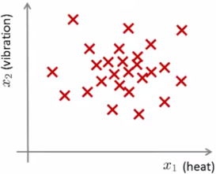
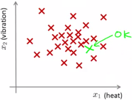
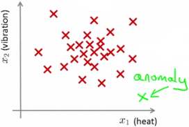
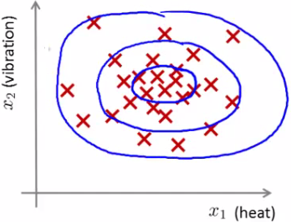
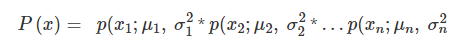
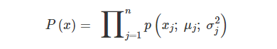
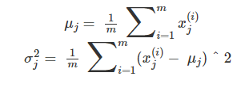
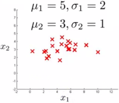
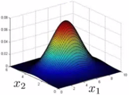

**Categoría:**
- Aprendizaje Automático
  - Aprendizaje No Supervisado
  - Aprendizaje Supervisado
**Tipo de Problemas**
- Clasificación

-------

#  ¿Cómo estudiar este tema?

En este tema se desarrollan los conceptos de las técnicas de detección de anomalías. Estas técnicas también se conocen en la literatura con el nombre de **detección de outliers**. En esencia un outlier es un valor poco habitual y, por tanto, puede ser considerado una anomalía.

- En primer lugar, se introducen los métodos de detección de anomalías y su **principal aplicación**.
- A continuación, se describe cómo se pueden utilizar los métodos de aprendizaje supervisado para utilizarse en el ámbito de la detección de anomalías.
- Posteriormente, se cubren las pautas necesarias para desarrollar y evaluar un sistema de detección de anomalías.
- Finalmente, se describen las **diferencias** existentes entre el **aprendizaje supervisado** y los **métodos de detección de anomalías**.

# Técnicas de detección de anomalías

Los problemas de detección de anomalías son una aplicación común del aprendizaje automático. Se pueden ver como una posible solución a un problema de **aprendizaje no supervisado**, pero tienen también aspectos de **aprendizaje supervisado**.

Pero, **¿qué es la detección de anomalías?** Imagine que trabaja en una empresa que fabrica motores de aviones. A medida que los motores salen de la cadena de montaje, se realiza una fase de aseguramiento de la calidad en la cual se miden algunas características de los motores (ejemplo: calor generado y vibración). Supongamos que tenemos un conjunto de datos con **"m" motores** que han sido evaluados positivamente y han dado como resultado lo dibujado en la siguiente gráfica.

  
*Gráfica 1. Distribución de valores de vibración y calor generado por motores. Fuente: https://es.coursera.org/learn/machine-learning*

A partir de ahora, al día siguiente se fabrica un nuevo motor y se utiliza un método de detección de anomalías para comprobar su correcto funcionamiento, comparando el de este motor nuevo con respecto a los motores previos. Si obtenemos una gráfica como esta:

  
*Gráfica 2. Distribución de valores de vibración y calor generado por motores. Ejemplo de una instancia correcta. Fuente: https://es.coursera.org/learn/machine-learning*

Lo más probable es que el motor funcione correctamente pues su comportamiento es muy similar al de motores previos. Sin embargo, si la gráfica fuera:

  
*Gráfica 3. Distribución de valores de vibración y calor generado por motores. Ejemplo de una instancia anómala Fuente: https://es.coursera.org/learn/machine-learning*

> Lo más probable es que el motor presente algún tipo de anomalía.

En este tipo de problemas partimos de un conjunto de datos que contiene registros normales, o bien la gran mayoría de ellos lo son. El objetivo es utilizar este conjunto como referencia y observar si existen nuevos ejemplos que son anómalos.

**¿Cómo se realiza esta comprobación?** En primer lugar, se utiliza el conjunto de entrenamiento para entrenar un modelo.

Este modelo responde a la pregunta: **¿cuál es la probabilidad de que el ejemplo x sea normal?**

Una vez que se ha construido el modelo:

- Si %20%3C%20\epsilon) se trata de una anomalía.
- Si %20\geq%20\epsilon)  se trata de un ejemplo normal.

Donde **ε** es un umbral de probabilidad definido en función de que nivel de certeza queramos tener. En el caso de un modelo en dos dimensiones, lo que estamos definiendo se puede representar gráficamente de la siguiente forma:

  
*Gráfica 4. Distribución de valores de vibración y calor generado por motores. Fuente: https://es.coursera.org/learn/machine-learning*

Donde a medida que nos alejamos del centro, la probabilidad de que aparezcan ejemplos similares disminuye.

## Aplicaciones

Las aplicaciones de los problemas de detección de anomalías son muy variadas. A continuación, se presentan dos ejemplos:

- **Detección de fraude:** se puede modelar a los usuarios en función de ciertos valores de su actividad como: localización del login, duración de tiempo online, frecuencia de gasto, etc. 
Utilizando este conjunto de datos se puede construir un modelo para generar el patrón de actividad habitual de los usuarios. Con este modelo se puede obtener la probabilidad de comportamiento «normal» para cada usuario y por tanto identificar usuarios anormales. Esto puede desencadenar acciones como bloquear el tráfico a determinados usuarios o automáticamente bloquear transacciones.  
- **Monitorización data-center:** si tenemos un data center con muchos ordenadores, se puede construir un conjunto de datos con información sobre cada ordenador (uso de memoria, accesos al disco, carga de CPU, etc.). En el caso de que se observe un comportamiento anómalo de un ordenador posiblemente sea porque vaya a fallar.

> La detección de anomalías combina las técnicas de aprendizaje supervisado para generar un modelo de valores normales y, posteriormente, se utiliza este modelo con nuevos registros para detectar valores anómalos o inus uales.

# Aplicación del aprendizaje automático a la detección de anomalías
Para realizar la detección de anomalías se puede utilizar el siguiente algoritmo de aprendizaje automático. Dado un conjunto de *m* ejemplos de entrenamiento sin etiquetar:

Donde cada ejemplo es un vector de ***n*** dimensiones y, por tanto, tenemos ***n*** variables. **Vamos a obtener la probabilidad de aparición de cada elemento** ***x***, que denotamos por ***P(x)***. Nos interesa conocer cuáles son las variables con alta y baja probabilidad de aparición, si ***x*** es un vector, el modelo ***P(x)*** se define como:

Por tanto, multiplicamos la probabilidad de cada una de las variables y asumimos que cada una de ellas se distribuye de acuerdo a una distribución gaussiana. Es decir, obtenemos la distribución de probabilidad de la variable 
 dado  y  utilizando una distribución gaussiana.

Por tanto, este modelo asume **independencia condicional de las variables**, aunque el algoritmo funciona si las variables son independientes o no. La fórmula anterior se puede escribir de forma compacta como:

El problema de estimar esta función se conoce también con el nombre de **estimación de densidad**.

## Algoritmo

1. Elegir variables  que consideres son buenos indicadores del comportamiento anómalo.
2. Ajustar los parámetros   

3. Dado un nuevo ejemplo ***x***, calcular ***p(x)***  
   

Tenemos una **anomalía** si <\epsilon) 

La **primera fase de elegir variables** consiste en obtener información que pueda identificar el comportamiento anómalo futuro de un cliente. Este comportamiento anómalo normalmente es inusualmente largo o pequeño.

La **segunda fase de ajuste de parámetros** determina los valores para cada uno de los ejemplos y parámetros  y 

La **tercera fase** se calcula los valores teniendo en cuenta la formula anterior (fórmula para la probabilidad gaussiana). Si este número es muy bajo, tenemos una probabilidad muy baja de que sea un registro normal.

Ejemplo de detección de anomalías

Supongamos que tenemos un modelo de dos dimensiones ***(X1 y X2)***. En el caso de la variable ***X1*** la media es 5 y la desviación estándar es 2. En el caso de la variable ***X2*** la media es 3 y la desviación estándar es 1. Tenemos ejemplos de datos que siguen esta distribución:

  
*Gráfica 5. Ejemplo de distribución de datos en función de dos variables. Fuente: https://es.coursera.org/learn/machine-learning*

Si pintamos la distribución de la variable ***X1*** y ***X2***, tenemos algo como:

  
*Gráfica 6. Distribución de cada una de las variables anteriores de forma independiente. Fuente: https://es.coursera.org/learn/machine-learning*

Y si pintamos el producto de ambas, obtenemos:

  
*Gráfica 7. Distribución las variables x1 y x2 de forma conjunta. Fuente: https://es.coursera.org*

En este gráfico de superficie, la altura de la superficie es la probabilidad p(x). No siempre es posible hacer este tipo de gráficos puesto que habitualmente se utilizan espacios de más de dos dimensiones para crear los sistemas de detección de anomalías. Para comprobar si un valor es anómalo se establece el parámetro épsilon a un determinado valor. Supongamos que ahora tenemos dos puntos nuevos: X3 y X4.P(x3) = 0.436, lo que nos da una probabilidad de un 43 % de que el dato sea normal y por otro lado P(x4)=0.0021, lo que nos da una probabilidad de un 0,2 % de que el dato sea normal.

En este caso, el segundo ejemplo X4 se detectaría como una anomalía.