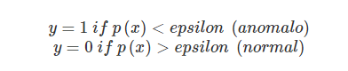

**Categoría:**
- Aprendizaje Automático
  - Aprendizaje No Supervisado
  - Aprendizaje Supervisado
  
**Tipo de Problemas**
- Clasificación Binaria

**Hiperparámetros**
- Se trata de encontrar el valor de **épsilon** que detecte todos los ejemplos de tipo anómalo. 

**Evaluación**
- En este caso como las clases están muy desbalanceadas, una buena métrica a utilizar es el cálculo de **f-measure**.
- Los ejemplos positivos se reservan para los conjuntos de validación cruzada y para el test, en caso existan pocos de clase positiva (anomalía), muy pocos para entrenar.

**Como Funciona**
- ¿cuál es la probabilidad de que el ejemplo x sea normal?
- Encontrar eventos anomalos, eventos con muy poca frecuencia.
- Detectar una anomalía antes de que ocurra es muy difícil, lo que si se puede es detectar la anomalía ya registrada.
- "Cisne Negro"

**Retos**  
- El reto es definir que es una región "normal".
- El límite entre lo normal y lo abnormal a veces no es claro, es difuso.
- La noción exacta de outlier es diferente para cada aplicación.
- Disponibilidad de datos etiquetados para train/test
- Comportamiento normal evoluciona. Por lo general el comportamiento normal no siempre es igual, sino que se modifica con el tiempo.

**Aplicaciones**
- Detección Intrusos en la red
- Detección fraude en tarjetas / seguros
- Diagnostico médico.
- Procesamiento imagen / video-vigilancia (por medio de sensores)
- Detección de tópicos novedosos en minería de textos (por ejemplo un algoritmo de detección de trending topics en twitter)

**Técnicas**
- Isolation Forest : 
  - Es una técnica que utiliza por dentro el algoritmo de random forest .
  - Lo que hace es, va aislando las observaciones de forma que construye un random forest y elige de forma aleatoria una variable del conjunto de datos, y ve los valores de corte máximos y mínimos para esa variable determinado en función de todo el conjunto de datos que tenemos.
  - Técnicas utilizadapara conjunto de datos con grandes dimensiones.
  - Creo que por default genera 10 arboles, pero se puede definir un factor de aletoriedad (rFactor = 0) Entre 0 y 1, 1 es que los arboles serán más aleatorios.
  - Puede generar un valor de anomalía en porcentaje , mientras más alto es más anomalo.
- Podemos utilizar técnicas de detección de anomalías o de búsqueda de outliers que sean Univariables (tienen en cuenta una variable)
- O Técnicas de detección de anomalías sobre un espacio de multiples dimensiones.
-------

#  ¿Cómo estudiar este tema?

En este tema se desarrollan los conceptos de las técnicas de detección de anomalías. Estas técnicas también se conocen en la literatura con el nombre de **detección de outliers**. En esencia un outlier es un valor poco habitual y, por tanto, puede ser considerado una anomalía.

- En primer lugar, se introducen los métodos de detección de anomalías y su **principal aplicación**.
- A continuación, se describe cómo se pueden utilizar los métodos de aprendizaje supervisado para utilizarse en el ámbito de la detección de anomalías.
- Posteriormente, se cubren las pautas necesarias para desarrollar y evaluar un sistema de detección de anomalías.
- Finalmente, se describen las **diferencias** existentes entre el **aprendizaje supervisado** y los **métodos de detección de anomalías**.

# Técnicas de detección de anomalías

Los problemas de detección de anomalías son una aplicación común del aprendizaje automático. Se pueden ver como una posible solución a un problema de **aprendizaje no supervisado**, pero tienen también aspectos de **aprendizaje supervisado**.

Pero, **¿qué es la detección de anomalías?** Imagine que trabaja en una empresa que fabrica motores de aviones. A medida que los motores salen de la cadena de montaje, se realiza una fase de aseguramiento de la calidad en la cual se miden algunas características de los motores (ejemplo: calor generado y vibración). Supongamos que tenemos un conjunto de datos con **"m" motores** que han sido evaluados positivamente y han dado como resultado lo dibujado en la siguiente gráfica.

  
*Gráfica 1. Distribución de valores de vibración y calor generado por motores. Fuente: https://es.coursera.org/learn/machine-learning*

A partir de ahora, al día siguiente se fabrica un nuevo motor y se utiliza un método de detección de anomalías para comprobar su correcto funcionamiento, comparando el de este motor nuevo con respecto a los motores previos. Si obtenemos una gráfica como esta:

  
*Gráfica 2. Distribución de valores de vibración y calor generado por motores. Ejemplo de una instancia correcta. Fuente: https://es.coursera.org/learn/machine-learning*

Lo más probable es que el motor funcione correctamente pues su comportamiento es muy similar al de motores previos. Sin embargo, si la gráfica fuera:

  
*Gráfica 3. Distribución de valores de vibración y calor generado por motores. Ejemplo de una instancia anómala Fuente: https://es.coursera.org/learn/machine-learning*

> Lo más probable es que el motor presente algún tipo de anomalía.

En este tipo de problemas partimos de un conjunto de datos que contiene registros normales, o bien la gran mayoría de ellos lo son. El objetivo es utilizar este conjunto como referencia y observar si existen nuevos ejemplos que son anómalos.

**¿Cómo se realiza esta comprobación?** En primer lugar, se utiliza el conjunto de entrenamiento para entrenar un modelo.

Este modelo responde a la pregunta: **¿cuál es la probabilidad de que el ejemplo x sea normal?**

Una vez que se ha construido el modelo:

- Si %20%3C%20\epsilon) se trata de una anomalía.
- Si %20\geq%20\epsilon)  se trata de un ejemplo normal.

Donde **ε** es un umbral de probabilidad definido en función de que nivel de certeza queramos tener. En el caso de un modelo en dos dimensiones, lo que estamos definiendo se puede representar gráficamente de la siguiente forma:

  
*Gráfica 4. Distribución de valores de vibración y calor generado por motores. Fuente: https://es.coursera.org/learn/machine-learning*

Donde a medida que nos alejamos del centro, la probabilidad de que aparezcan ejemplos similares disminuye.

## Aplicaciones

Las aplicaciones de los problemas de detección de anomalías son muy variadas. A continuación, se presentan dos ejemplos:

- **Detección de fraude:** se puede modelar a los usuarios en función de ciertos valores de su actividad como: localización del login, duración de tiempo online, frecuencia de gasto, etc. 
Utilizando este conjunto de datos se puede construir un modelo para generar el patrón de actividad habitual de los usuarios. Con este modelo se puede obtener la probabilidad de comportamiento «normal» para cada usuario y por tanto identificar usuarios anormales. Esto puede desencadenar acciones como bloquear el tráfico a determinados usuarios o automáticamente bloquear transacciones.  
- **Monitorización data-center:** si tenemos un data center con muchos ordenadores, se puede construir un conjunto de datos con información sobre cada ordenador (uso de memoria, accesos al disco, carga de CPU, etc.). En el caso de que se observe un comportamiento anómalo de un ordenador posiblemente sea porque vaya a fallar.

> La detección de anomalías combina las técnicas de aprendizaje supervisado para generar un modelo de valores normales y, posteriormente, se utiliza este modelo con nuevos registros para detectar valores anómalos o inus uales.

# Aplicación del aprendizaje automático a la detección de anomalías
Para realizar la detección de anomalías se puede utilizar el siguiente algoritmo de aprendizaje automático. Dado un conjunto de *m* ejemplos de entrenamiento sin etiquetar:

Donde cada ejemplo es un vector de ***n*** dimensiones y, por tanto, tenemos ***n*** variables. **Vamos a obtener la probabilidad de aparición de cada elemento** ***x***, que denotamos por ***P(x)***. Nos interesa conocer cuáles son las variables con alta y baja probabilidad de aparición, si ***x*** es un vector, el modelo ***P(x)*** se define como:

Por tanto, multiplicamos la probabilidad de cada una de las variables y asumimos que cada una de ellas se distribuye de acuerdo a una distribución gaussiana. Es decir, obtenemos la distribución de probabilidad de la variable 
 dado  y  utilizando una distribución gaussiana.

Por tanto, este modelo asume **independencia condicional de las variables**, aunque el algoritmo funciona si las variables son independientes o no. La fórmula anterior se puede escribir de forma compacta como:

El problema de estimar esta función se conoce también con el nombre de **estimación de densidad**.

## Algoritmo

1. Elegir variables  que consideres son buenos indicadores del comportamiento anómalo.
2. Ajustar los parámetros   

3. Dado un nuevo ejemplo ***x***, calcular ***p(x)***  
   

Tenemos una **anomalía** si <\epsilon) 

La **primera fase de elegir variables** consiste en obtener información que pueda identificar el comportamiento anómalo futuro de un cliente. Este comportamiento anómalo normalmente es inusualmente largo o pequeño.

La **segunda fase de ajuste de parámetros** determina los valores para cada uno de los ejemplos y parámetros  y 

La **tercera fase** se calcula los valores teniendo en cuenta la formula anterior (fórmula para la probabilidad gaussiana). Si este número es muy bajo, tenemos una probabilidad muy baja de que sea un registro normal.

Ejemplo de detección de anomalías

Supongamos que tenemos un modelo de dos dimensiones ***(X1 y X2)***. En el caso de la variable ***X1*** la media es 5 y la desviación estándar es 2. En el caso de la variable ***X2*** la media es 3 y la desviación estándar es 1. Tenemos ejemplos de datos que siguen esta distribución:

  
*Gráfica 5. Ejemplo de distribución de datos en función de dos variables. Fuente: https://es.coursera.org/learn/machine-learning*

Si pintamos la distribución de la variable ***X1*** y ***X2***, tenemos algo como:

  
*Gráfica 6. Distribución de cada una de las variables anteriores de forma independiente. Fuente: https://es.coursera.org/learn/machine-learning*

Y si pintamos el producto de ambas, obtenemos:

  
*Gráfica 7. Distribución las variables x1 y x2 de forma conjunta. Fuente: https://es.coursera.org*

> En este gráfico de superficie, la altura de la superficie es la probabilidad ***p(x)***. No siempre es posible hacer este tipo de gráficos puesto que habitualmente se utilizan espacios de más de dos dimensiones para crear los sistemas de detección de anomalías. Para comprobar si un valor es anómalo se establece el parámetro épsilon a un determinado valor. Supongamos que ahora tenemos dos puntos nuevos: ***X3*** y ***X4***. ***P(x3) = 0.436***, lo que nos da una probabilidad de un **43 %** de que el dato sea normal y por otro lado ***P(x4)=0.0021***, lo que nos da una probabilidad de un **0,2 %** de que el dato sea normal.  
En este caso, el segundo ejemplo ***X4*** se detectaría como una anomalía.

# Desarrollando y evaluando un sistema de detección de anomalías

Un aspecto importante cuando se desarrolla un sistema de detección de anomalías es **cómo se realiza la evaluación utilizando una métrica objetiva**. Esta fase de evaluación es muy relevante porque suele ser habitual y necesario el tener que tomar ciertas decisiones. Estas decisiones son más sencillas de tomar si el resultado del algoritmo es un único número que demuestra que los cambios realizados mejoran o empeoran el rendimiento del sistema de detección de anomalías.

Además, para desarrollar un sistema de detección de anomalías de forma rápida **es útil disponer de una métrica de evaluación.** Supongamos que disponemos de datos etiquetados sobre ejemplos anómalos y no. La evaluación puede considerar estos ejemplos para obtener una métrica de calidad del modelo.

Retomando el ejemplo de los motores. Tenemos datos etiquetados de los motores donde las muestras normales las etiquetamos con 0 y las muestras anómalas con 1. El conjunto de entrenamiento es el conjunto de ejemplos. A continuación, es necesario definir el conjunto de validación cruzada para entrenamiento, el conjunto de test y, para ambos, incluimos algunos ejemplos anómalos.

> Por ejemplo, podemos tener **10 000 motores buenos** y **20 motores anómalos**, lo que nos proporciona un ratio de **1-500**. Una posible división sería un conjunto de entrenamiento con 6000 ejemplos de tipo 0 (normales), **un conjunto de validación cruzada** con 2000 ejemplos de tipo 0 y 10 ejemplos de tipo 1 y **un conjunto de test** con 2000 ejemplos de tipo 0 y los otros 10 ejemplos de tipo 1.

El modelo ***p(x)*** se entrena sobre los datos de entrenamiento y se prueba con los ejemplos en el conjunto de validación cruzada y de tipo test:

Se trata de **encontrar el valor de épsilon que detecte todos los ejemplos de tipo anómalo**. Es decir, puede verse como un problema de clasificación binaria, pero en este caso como las clases están muy desbalanceadas, una buena métrica a utilizar es el cálculo de f-measure.

# Detección de anomalías vs. aprendizaje supervisado
La principal diferencia del uso de algoritmos de detección de anomalías con respecto de los algoritmos de aprendizaje supervisado viene dada por **el número de ejemplos positivos frente a los negativos**. En el caso del aprendizaje supervisado es posible extraer patrones de los ejemplos positivos y el aprendizaje se realiza con ejemplos de las dos clases. Por otro lado, en el caso de la detección de anomalías al tener muy pocos ejemplos de la clase positiva no hay suficientes datos para «aprender» el patrón de la clase positiva. Por este motivo, **los ejemplos positivos se reservan para los conjuntos de validación cruzada y para el test.**

Además de tener pocos ejemplos de la clase positiva (anomalía) hay veces en que los tipos de anomalías son muy diferentes entre sí y, por tanto, no es posible extraer un patrón determinado.

Por otro lado, en el caso del aprendizaje supervisado tenemos un número razonable de ejemplos positivos y negativos. O bien, esperamos que todas las anomalías se comporten de una forma similar entre ellas.

#### **Technique Isolation Forest :**

----

## Lectura

**Detección de anomalías en Python**  
Scikit learn. (s. f.) Novelty and Outlier Detection.  
En esta página se describe los métodos implementados en la librería scikit learn de Python para realizar la detección de anomalías :
- http://scikit-learn.org/stable/modules/outlier_detection.html

**Data-driven Anomay Detection**  
Charla de Nikunj Oza en Google, dentro de la serie de charlas técnicas. El vídeo cubre 
el trabajo del equipo de data science de la Nasa en detección de anomalías aplicadas 
al control de tráfico aéreo.
- https://www.youtube.com/watch?v=5mBiac_dhbs

**Anomaly Detection for Payment Proccesing at Netflix**  
Charla en Association for Computing Machinery (ACM) sobre la detección de anomalías para el procesamiento de pagos que se ha realizado en la empresa Netflix donde se discuten tanto los retos científicos de trabajar con datos de 50 millones de clientes como los retos técnicos de montar una solución con una arquitectura escalable
- https://www.youtube.com/watch?v=xjHlu9OViVc

