# Etiquetado morfosintáctico (POS tagging)

### Contenido
- [x] Categorías morfosintácticas o gramaticales
- [x] Funcionamiento y características del etiquetado morfosintáctico
- [x] Etiquetado morfosintáctico basado en modelos ocultos de Markov (HMM)
- [ ] Etiquetado morfosintáctico basado en aprendizaje automático

---------

Hablaremos del etiquetado morfosintáctico y cómo calcularlo, haciendo especial hincapié en los modelos  ocultos de Markov (Hidden Markov Models)

## Categorías morfosintácticas o gramaticales
**Morfosintaxis** :  Parte de la gramática que integra la **morfología** y la **sintaxis**

Las categorías morfosintácticas del lenguaje, que en español también se llaman categorías gramaticales, proporcionan una clasificación de las diferentes partes de la oración, es decir, una clasificación de las palabras según su tipo.

Las categorías gramaticales del español, según la clasificación clásica (RAE), son 9:

| Categorías  morfosintácticas| Detalle |
|---------------------|----------------------------------------------|
|**Sustantivo o nombre**| Clase de palabras cuyos elementos poseen género y número, forman sintagmas nominales con diversas funciones sintácticas y designan entidades de diferente naturaleza.|
|  **Determinante**     |  Clase de palabras cuyos elementos determinan al sustantivo o al grupo nominal y se sitúan generalmente en posición prenominal. El artículo definido y los demostrativos son determinantes. |
|  **Adjetivo**          |  Clase de palabras cuyos elementos modifican a un sustantivo o se predican de él y denotan cualidades, propiedades y relaciones de diversa naturaleza. Ejemplos: inteligente, amplio, numérico, mismo, telefónico… |
|  **Pronombre**  | Clase de palabras cuyos elementos hacen las veces del sustantivo o del sintagma nominal y que se emplean para referirse a las personas, los animales o las cosas sin nombrarlos. P. ej.: ella, esto, quién… |
|  **Verbo**   | Clase de palabras cuyos elementos pueden tener variación de persona, número, tiempo, modo y aspecto. |
| **Adverbio** |  Clase de palabras cuyos elementos son invariables y tónicos, están dotados generalmente de significado léxico y modifican el significado de varias categorías, principalmente de un verbo, de un adjetivo, de una oración o de una palabra de la misma clase. |
| **Preposición** | Clase de palabras invariables cuyos elementos se caracterizan por introducir un término, generalmente nominal u oracional, con el que forman grupo sintáctico |
| **Conjunción**| Clase de palabras invariables, generalmente átonas, cuyos elementos manifiestan relaciones de coordinación o subordinación entre palabras, grupos sintácticos u oraciones. |
|**Interjección** | Clase de palabras invariables, con cuyos elementos se forman enunciados exclamativos, que manifiestan impresiones, verbalizan sentimientos o realizan actos de habla apelativos. |

## Funcionamiento y características del etiquetado morfosintáctico
El etiquetado morfosintáctico, llamado **POS tagging** (part-of-speech tagging) en inglés, es el proceso para identificar las diferentes partes de la oración y consiste en asignar una etiqueta (tag) sobre la categoría gramatical a cada una de las palabras de un texto de entrada.

La entrada del algoritmo de etiquetado morfosintáctico es una secuencia de palabras y la salida del algoritmo es una secuencia de pares formados por la palabra y la correspondiente etiqueta indicando la categoría gramatical a la que pertenece dicha palabra.

Hoy en día, la mayoría de los algoritmos de procesamiento del lenguaje natural que procesan palabras en inglés utilizan el **Penn Treebank** (Marcus, Santorini y Marcinkiewicz, 1993).

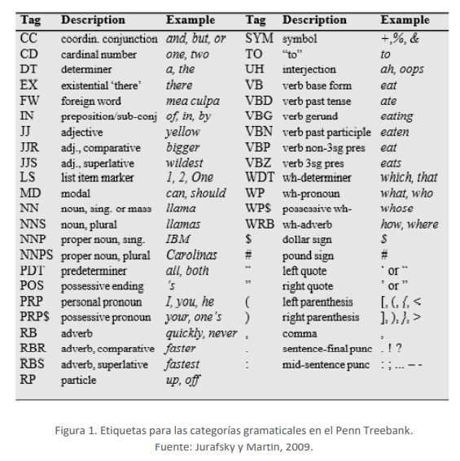

#### Ejemplos. 
Si el etiquetador morfosintáctico analiza la frase **"bebo un vaso del vino tinto"**, suponiendo que se utilizan las etiquetas para las categorías gramaticales definidas en el Penn Treebank, la salida sería:

`bebo/VBP un/DT vaso/NN de/IN el/DT vino/NN tinto/JJ`

Para la frase **"vino de un lugar lejano"**, el etiquetado morfosintáctico sería:

`vino/VBZ de/IN un/DT lugar/NN lejano/JJ`

Así, el etiquetado morfosintáctico realiza durante su funcionamiento un proceso de **desambiguación**: una palabra, que es ambigua y puede pertenecer a más de una categoría gramatical, se etiqueta correctamente según el contexto de la frase analizada.

Identificar que una palabra es una contracción (del) y separarla en las dos (de y el) que la constituyen forma parte del proceso previo de **preprocesado** de la oración.

La identificación de las palabras de una oración también es llamada proceso de **obtención de los tokens,** porque token es el nombre inglés para definir una cadena de caracteres que representa una palabra y se realiza siempre previamente al etiquetado morfosintáctico y a otras tareas de procesamiento del lenguaje natural.

## Etiquetado morfosintáctico basado en modelos ocultos de Markov (HMM)
Un modelo oculto de Markov es un **modelo estadístico** que se puede representar como una máquina de estados finitos, pero **donde las transacciones entre estados son probabilísticas** y no determinísticas. El objetivo es determinar los parámetros desconocidos (ocultos) a partir de los parámetros observables.

Para el etiquetado morfosintáctico, los HMM son entrenados en un conjunto de datos totalmente etiquetados, los HMM fijan estimaciones de máxima verosimilitud para cada uno de los estados y determina las diferentes probabilidades que rigen el modelo. Para llevar a cabo el proceso de estimación de probabilidades se usa el algoritmo de decodificación de Viterbi (Forney, 1973). 

El objetivo de decodificación HMM es elegir la secuencia de etiquetas más probable dada la secuencia de observación de 𝑛 palabras 𝑤 𝑛1:

Ecuación Final, agregando la regla de bayes y simplificando al eliminar el denominador:

Los **etiquetadores HMM** hacen dos suposiciones que permiten simplificar estas ecuaciones aún más:
1. La primera es que la probabilidad de aparición de una palabra depende solo de su 
propia etiqueta y es independiente de las palabras y etiquetas vecinas.
2. La segunda suposición, también llamada bigrama o digrama, es que la probabilidad de una etiqueta solo depende de la etiqueta anterior, en lugar de toda la secuencia de etiquetas.

Aplicando estas suposiciones a las ecuaciones anteriores terminamos con la siguiente ecuación para la secuencia de etiquetas más probable de un etiquetador bigrama, las cuales corresponden a la **probabilidad de emisión** y la **probabilidad de transición** de un HMM:

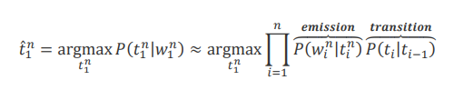

### Ejemplos de probabilidad de transición y probabilidad de emisión
> Un **corpus lingüístico** es una colección de textos representativos de una lengua que se utilizan para el análisis lingüístico. Los corpus pueden estar **anotados o etiquetados** de forma que las palabras que lo conforman presentan, además, algún tipo de información lingüística.

#### **Probabilidades de transición**
Las probabilidades de transición de etiqueta 𝑃(𝑡𝑖|𝑡𝑖−1) representan la probabilidad de una etiqueta dada la etiqueta anterior. Por ejemplo, los verbos modales (etiqueta MD) como «can» (poder) son muy probablemente seguidos por un verbo en la forma base (etiqueta VB) como «run» (correr), por lo que espera que esta probabilidad sea 
alta.

En el corpus WSJ, por ejemplo, los MD aparecen 13 124 veces, de las cuales son seguidos por un VB 10 471 veces, lo cual resulta en una estimación de máxima probabilidad de 80% :

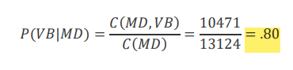

#### **Probabilidades de emisión**
Las probabilidades de emisión 𝑃(𝑤1𝑛|𝑡1𝑛) representan la probabilidad de que, dada una etiqueta (digamos MD), esta se asocie con una palabra concreta (digamos «will»). La estimación de **máxima verosimilitud **de la probabilidad de emisión en general se define como:

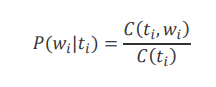

De los 13 124 casos de MD en el corpus WSJ, estas se asocian o refieren a «will» en 
4046 ocasiones, por tanto:

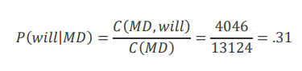

Como aclaración, hemos de decir que esta probabilidad no se refiere a «cuál es la etiqueta más probable para la palabra ‘will’», ya que esta sería la probabilidad a posteriori 𝑃(𝑀𝐷|𝑤𝑖𝑙𝑙). En su lugar, 𝑃(𝑤𝑖𝑙𝑙|𝑀𝐷) responde a una pregunta ligeramente menos intuitiva, concretamente **«si vamos a generar una etiqueta MD, ¿qué probabilidades hay de que este MD sea ‘wil’?»**. 😀

La figura 2 ilustra algunas de las probabilidades de transición A para tres estados en un etiquetador morfosintáctico HMM; el etiquetador completo tendría un estado para cada etiqueta. En esta imagen, las probabilidades de transición A se utilizan para calcular la probabilidad a priori

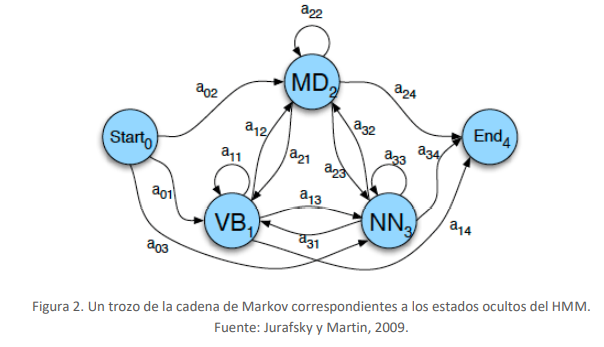

La figura 3 muestra otra vista de estos tres estados, pero centrándose en algunas de las probabilidades de observación B de cada palabra. Cada estado oculto está asociado con un vector de probabilidades para cada palabra en observación.

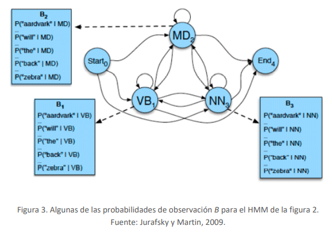

#### Ejemplo. 
Finalmente, vamos a trabajar a través de un ejemplo de cálculo de la mejor secuencia de etiquetas que corresponde a la siguiente secuencia de palabras: **«Janet will back the bill»** (en español, «Janet respaldará la ley»). La secuencia de etiquetas correcta es:

`Janet/NNP will/MD back/VB the/DT bill/NN`

Sea el modelo HMM el definido por el conjunto A de probabilidades de transición (figura 4), y el conjunto B de probabilidades de observación (figura 5). Cada elemento 𝑎𝑖𝑗 del conjunto A describe la probabilidad de transitar de un estado oculto 𝑖 (etiqueta 𝑖) a otro estado oculto 𝑗 (etiqueta 𝑗). Cada elemento 𝑏𝑖(𝑜𝑡) describe la probabilidad de observar las palabras dadas las etiquetas:

La siguiente imagen (figura 5) se obtiene a partir del recuento de apariciones de una palabra en el corpus. Así:
- La palabra Janet solo aparece como un nombre propio (NNP)
- La palabra will aparece en el corpus como tres categorías gramaticales diferentes; puede ser:
  - Un verbo modal (MD) para generar el futuro de los verbos en inglés.
  - Un verbo (VB) que significa «desear» en español.
  - O un nombre (NN) que significa «deseo» o «voluntad» en español

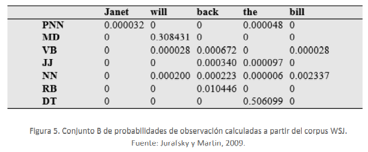

La figura 6 muestra un esquema con las posibles etiquetas para el ejemplo anterior, así como la correcta secuencia de etiquetado final. Esta secuencia del etiquetado morfosintáctico se ha calculado aplicando el algoritmo de Viterbi, cuyo pseudocódigo se presenta en la figura 7.

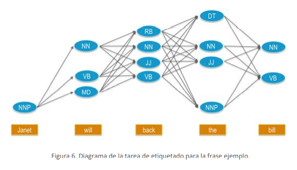

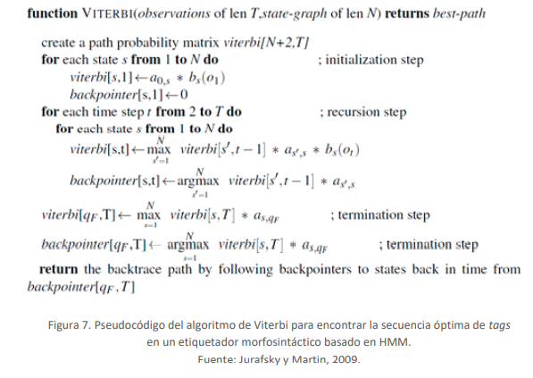

El algoritmo de Viterbi crea una matriz de probabilidades con una columna para** cada observación** 𝑡 y una fila para** cada estado** 𝑞𝑖 de la **máquina de estados finitos **(o autómata finito) que representa el HMM. Para el ejemplo, el algoritmo crea N = 5 columnas de estado, la primera para la observación de la primera palabra «Janet», la segunda para «will» y así sucesivamente hasta completar las cinco palabras que conforman la frase, tal como se muestra en la figura 8.

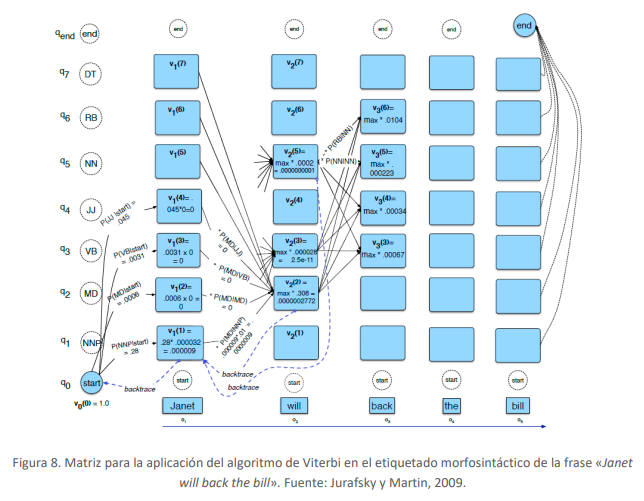
