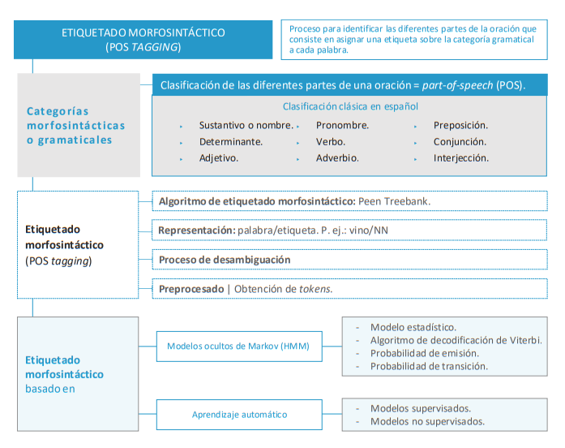
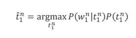

# Etiquetado morfosintáctico (POS tagging)

### Contenido
- [x] Categorías morfosintácticas o gramaticales
- [x] Funcionamiento y características del etiquetado morfosintáctico
- [x] Etiquetado morfosintáctico basado en modelos ocultos de Markov (HMM)
- [ ] Etiquetado morfosintáctico basado en aprendizaje automático

---------

Hablaremos del etiquetado morfosintáctico y cómo calcularlo, haciendo especial hincapié en los modelos  ocultos de Markov (Hidden Markov Models)

## Categorías morfosintácticas o gramaticales
**Morfosintaxis** :  Parte de la gramática que integra la **morfología** y la **sintaxis**

Las categorías morfosintácticas del lenguaje, que en español también se llaman categorías gramaticales, proporcionan una clasificación de las diferentes partes de la oración, es decir, una clasificación de las palabras según su tipo.

Las categorías gramaticales del español, según la clasificación clásica (RAE), son 9:

| Categorías  morfosintácticas| Detalle |
|---------------------|----------------------------------------------|
|**Sustantivo o nombre**| Clase de palabras cuyos elementos poseen género y número, forman sintagmas nominales con diversas funciones sintácticas y designan entidades de diferente naturaleza.|
|  **Determinante**     |  Clase de palabras cuyos elementos determinan al sustantivo o al grupo nominal y se sitúan generalmente en posición prenominal. El artículo definido y los demostrativos son determinantes. |
|  **Adjetivo**          |  Clase de palabras cuyos elementos modifican a un sustantivo o se predican de él y denotan cualidades, propiedades y relaciones de diversa naturaleza. Ejemplos: inteligente, amplio, numérico, mismo, telefónico… |
|  **Pronombre**  | Clase de palabras cuyos elementos hacen las veces del sustantivo o del sintagma nominal y que se emplean para referirse a las personas, los animales o las cosas sin nombrarlos. P. ej.: ella, esto, quién… |
|  **Verbo**   | Clase de palabras cuyos elementos pueden tener variación de persona, número, tiempo, modo y aspecto. |
| **Adverbio** |  Clase de palabras cuyos elementos son invariables y tónicos, están dotados generalmente de significado léxico y modifican el significado de varias categorías, principalmente de un verbo, de un adjetivo, de una oración o de una palabra de la misma clase. |
| **Preposición** | Clase de palabras invariables cuyos elementos se caracterizan por introducir un término, generalmente nominal u oracional, con el que forman grupo sintáctico |
| **Conjunción**| Clase de palabras invariables, generalmente átonas, cuyos elementos manifiestan relaciones de coordinación o subordinación entre palabras, grupos sintácticos u oraciones. |
|**Interjección** | Clase de palabras invariables, con cuyos elementos se forman enunciados exclamativos, que manifiestan impresiones, verbalizan sentimientos o realizan actos de habla apelativos. |

## Funcionamiento y características del etiquetado morfosintáctico
El etiquetado morfosintáctico, llamado **POS tagging** (part-of-speech tagging) en inglés, es el proceso para identificar las diferentes partes de la oración y consiste en asignar una etiqueta (tag) sobre la categoría gramatical a cada una de las palabras de un texto de entrada.

La entrada del algoritmo de etiquetado morfosintáctico es una secuencia de palabras y la salida del algoritmo es una secuencia de pares formados por la palabra y la correspondiente etiqueta indicando la categoría gramatical a la que pertenece dicha palabra.

Hoy en día, la mayoría de los algoritmos de procesamiento del lenguaje natural que procesan palabras en inglés utilizan el Penn Treebank (Marcus, Santorini y Marcinkiewicz, 1993).

#### Ejemplos. 
Si el etiquetador morfosintáctico analiza la frase **"bebo un vaso del vino tinto"**, suponiendo que se utilizan las etiquetas para las categorías gramaticales definidas en el Penn Treebank, la salida sería:

`bebo/VBP un/DT vaso/NN de/IN el/DT vino/NN tinto/JJ`

Para la frase **"vino de un lugar lejano"**, el etiquetado morfosintáctico sería:

`vino/VBZ de/IN un/DT lugar/NN lejano/JJ`

Así, el etiquetado morfosintáctico realiza durante su funcionamiento un proceso de **desambiguación**: una palabra, que es ambigua y puede pertenecer a más de una categoría gramatical, se etiqueta correctamente según el contexto de la frase analizada.

Identificar que una palabra es una contracción (del) y separarla en las dos (de y el) que la constituyen forma parte del proceso previo de **preprocesado** de la oración.

La identificación de las palabras de una oración también es llamada proceso de **obtención de los tokens,** porque token es el nombre inglés para definir una cadena de caracteres que representa una palabra y se realiza siempre previamente al etiquetado morfosintáctico y a otras tareas de procesamiento del lenguaje natural.

## Etiquetado morfosintáctico basado en modelos ocultos de Markov (HMM)
Un modelo oculto de Markov es un **modelo estadístico** que se puede representar como una máquina de estados finitos, pero **donde las transacciones entre estados son probabilísticas** y no determinísticas. El objetivo es determinar los parámetros desconocidos (ocultos) a partir de los parámetros observables.

Para el etiquetado morfosintáctico, los HMM son entrenados en un conjunto de datos totalmente etiquetados, los HMM fijan estimaciones de máxima verosimilitud para cada uno de los estados y determina las diferentes probabilidades que rigen el modelo. Para llevar a cabo el proceso de estimación de probabilidades se usa el algoritmo de decodificación de Viterbi (Forney, 1973). El objetivo de decodificación HMM es elegir 
la secuencia de etiquetas más probable dada la secuencia de observación de 𝑛 palabras 𝑤 𝑛1:

Ecuación Final, agregando la regla de bayes y simplificando al eliminar el denominador:

